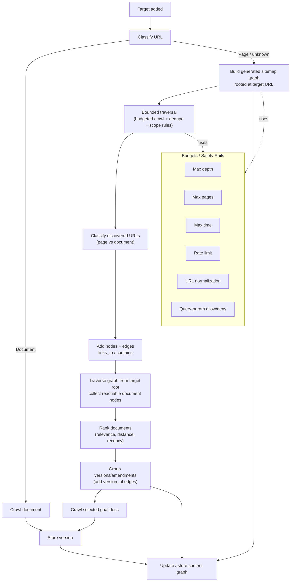

# Adaptive Crawling: Generated Sitemap Graph Strategy

## Context / Problem
Many target sites do **not** reliably expose `robots.txt` and/or `sitemap.xml`, and even when they do, the sitemap may be incomplete, stale, or not scoped to the specific section the user cares about.

We want the crawler to be **robust** (works without site-provided sitemaps) and **adaptive** (finds the most relevant documents, including amendments/newer versions).

## Goal
Given a user-provided target URL, we will:

- Determine whether the target is already a **document URL** (not just a PDF).
- If it is, crawl it directly.
- If it is not, **generate our own sitemap** as a **graph** rooted at the user-provided URL (section-scoped), then traverse this graph to discover the most relevant document URLs.
- Persist the generated graph so future runs can reuse it and detect changes over time.

## Key Definitions

- **Document URL**: Any URL that returns crawlable “document-like” content, including (but not limited to) PDF, HTML, Markdown, XML, JSON, TXT, and “download” endpoints that return an attachment.
- **Generated sitemap graph**: A directed graph where:
  - Nodes are discovered URLs (pages + documents)
  - Edges represent navigational relationships (e.g. `links_to`, `contains`, `version_of`)
  - The root node is the user-provided target URL
- **Goal nodes**: “Document nodes” reachable from the target root, ranked by relevance/recency.

## Strategy Overview

### 1) Classify the target URL
The classification should be **content-type driven**, not extension-driven.

Use a layered approach:

- **HEAD-based signals (fast path)**
  - `content-disposition: attachment` → treat as **document** (very strong signal)
  - `content-type` in a document allowlist → treat as **document**
  - `content-type: text/html` → treat as **page** (usually)
- **Lightweight sniffing (fallback)**
  - Fetch first N bytes (Range request if possible) and detect:
    - PDF magic bytes `%PDF-`
    - HTML (`<!doctype html>`, `<html`)
    - XML (`<?xml`)
    - JSON (`{`, `[`)
    - Markdown/text → treat as document if `text/plain` or `text/markdown`
- **URL hints (low confidence; used for scoring, not hard classification)**
  - `/download`, `/document`, `/files`, `?file=`, `?attachment=`, etc.

Output: `page | document | binary_unknown` (and a confidence score).

### 2) If document: crawl immediately
If the URL is a document, crawl it directly and store a version.

### 3) Otherwise: build a generated sitemap graph (section-scoped)
Generate a graph rooted at the **user-provided target URL**, not necessarily the site root.

Recommended traversal method:

- Start with a **best-first crawl** (priority queue) or bounded BFS.
- Add strict budgets and deduplication to avoid crawl explosions:
  - **Max pages** (e.g. 50–200)
  - **Max depth** (e.g. 2–5)
  - **Max wall time**
  - **Max per-host requests per minute**
  - **Consecutive empty/irrelevant page cutoff**
- Only crawl within allowed scope:
  - Same origin (required)
  - Optionally same path prefix (recommended for section targets)
- Normalize URLs:
  - Strip fragments
  - Canonicalize trailing slashes
  - Sort/whitelist query params
  - Deduplicate by normalized URL

While crawling pages:

- Extract outbound links
- Add edges `links_to` (page → page) and `links_to` (page → document)
- Classify linked URLs using the classifier from step (1)
- Optionally detect “version-like” relationships and add `version_of` edges (see section below)

### 4) Traverse the graph to select goal documents
From the root node (the user URL), traverse reachable nodes and collect document nodes (“goal nodes”).

Rank goal nodes using a weighted score such as:

- **Distance from root** (closer is better)
- **Relevance** (match to target label/category/jurisdiction and learned relevance model)
- **Recency** (`last-modified`, `etag`, or date/version patterns in URL/title)
- **Document-ness confidence** (attachment disposition, strong content-type, etc.)

### 5) Handle amendments / multiple versions (adaptiveness)
It’s common for multiple documents to exist where one is a newer version/amendment.

Approach:

- Cluster documents into “families” using:
  - Normalized title similarity
  - Shared stable URL stem
  - Stable identifier extraction (doc number, slug)
- Within a family, infer ordering by:
  - `last-modified` header
  - Date/version patterns in URL/title (e.g. `2025-01-01`, `v2`, `version-3`)
- Add graph edges: `version_of` (newer → older, or older → newer; pick one direction consistently)
- For crawling:
  - Prefer newest as primary
  - Still crawl older versions when needed for diff lineage and historical context

### 6) Persist the generated sitemap graph
Persisting the generated graph enables:

- Fast reuse on subsequent crawls
- Structural diffing over time
- Learning update patterns (new files added vs modified vs versioned URLs)

Persistence recommendations:

- Store the whole graph JSON (nodes + edges) as the “source of truth”
- Also store per-node metadata for indexing/search
- Optionally store edges in a dedicated table for graph queries (if needed)

## Flowchart

## Notes / Implementation Fit

- This strategy should be implemented as an additional “discovery strategy” that can run when sitemap/robots discovery fails or yields poor coverage.
- The generated sitemap graph should be a first-class `ContentGraph` so we can:
  - reuse existing diffing/pattern detection
  - store it in the existing content graph persistence layer
  - treat document nodes (not only PDFs) as crawl candidates

